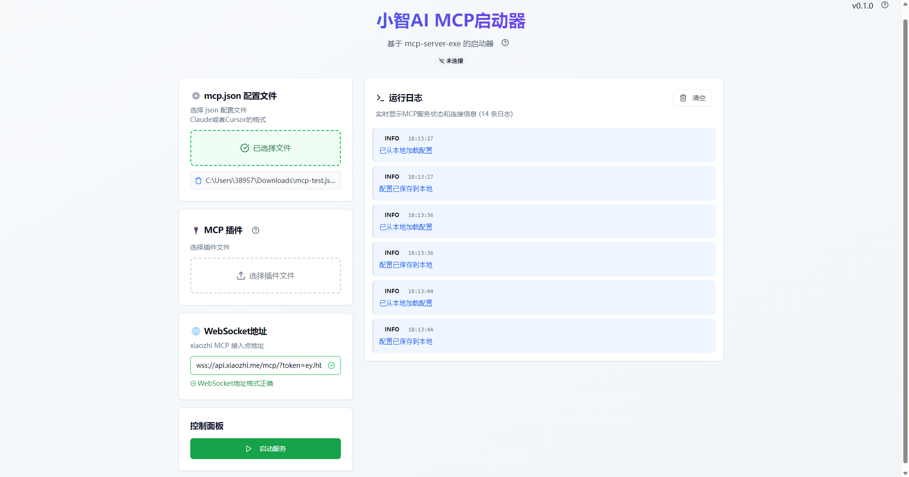

# xiaozhi-mcp-client

可视化的配置和管理，给xiaozhi接入mcp

[下载使用](https://github.com/shadowcz007/xiaozhi-mcp-client/releases)

动手能力强的可以尝试命令行模式 [mcp-server-exe](https://github.com/shadowcz007/mcp_server_exe)

交流可加入 [codenow.wiki](https://codenow.wiki/)
